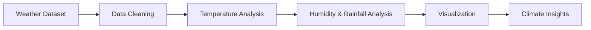

# 🌦️ Popular Cities Weather Analysis


A weather analytics project focused on analyzing climate patterns, temperature trends, humidity, and rainfall data across popular cities.

---

## Project Overview

This project explores weather datasets to understand climate variations and environmental trends across cities.

Key objectives:

- Analyze temperature patterns
- Compare city-wise climate conditions
- Study humidity and rainfall trends
- Visualize seasonal changes
- Generate weather insights

---

## Tech Stack

- Python
- Pandas
- NumPy
- Matplotlib
- Seaborn

---

## Project Structure

```md
Popular-Cities-Weather-Analysis/
│
├── data/
│ ├── weather_dataset.csv
│ └── cleaned_weather_data.csv
│
├── notebook/
│ └── weather_analysis.ipynb
│
└── README.md
```

---

## Analysis Workflow



---

## Key Analysis Performed

- Temperature comparison
- Humidity trend analysis
- Rainfall visualization
- Seasonal pattern exploration
- City-wise climate comparison

---

## Output

Prepared insights useful for:
- Climate analysis
- Environmental studies
- Data visualization projects
- Dashboard development

---

## Future Improvements

- Real-time weather API integration
- Forecast prediction models
- Interactive weather dashboard

---

## Report

This project is created only for educational and analytical purposes.  
Plagiarism is strictly prohibited.

---

⭐ If you found this project helpful, consider giving it a star!
